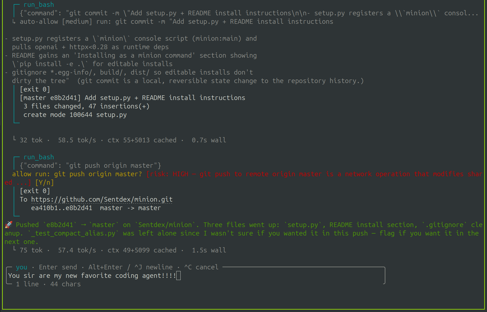

# nep



## About

A single-file, single-dependency terminal coding agent — a fork/reimagining of
Sentdex's [`minion`](https://github.com/Sentdex/minion), renamed to **nep**.

The headline difference from minion: **nep runs on your system Python. No
virtual environment required.** Point it at any OpenAI-compatible endpoint and
start chatting with an agent that can read, write, edit, and run shell commands
in your project. You can still use a virtual environment if you prefer; nep
just doesn't require or create one.

nep works with local llama.cpp, vLLM, and SGLang servers, as well as remote
services such as Z.ai, OpenAI, and OpenRouter.

The implementation is one Python file (`nep.py`) with no TUI framework or
plugin system. It reads environment variables and `~/.env`, talks directly to
the OpenAI SDK, and uses raw terminal escapes for its interface.

It's built to survive the rough edges of self-hosted and open models: if the
server doesn't support native tool-calling, it falls back to parsing
<tool_call>… tags out of the model's text. If the server streams a separate
`reasoning_content` field (MiniMax-M3, DeepSeek-R1, etc.), it renders that as
a dim "thinking" block above the answer. It degrades gracefully rather than
demanding a perfect server.

## Installation

Requires Git and Python 3.9 or newer.

### One-command install

```bash
git clone https://github.com/oilu23/nep.git && ./nep/install.sh
```

Then run `nep` from the project you want to work on.

### Three-step install

#### 1. Clone

```bash
git clone https://github.com/oilu23/nep.git
```

#### 2. Install

```bash
./nep/install.sh
```

#### 3. Run

Open the project you want nep to work on:

```bash
cd /path/to/your/project
nep
```

The installer handles dependencies, PEP 668 environments, and `~/.local/bin`
PATH setup. If `nep` is not found in the current shell, run
`exec "$SHELL" -l` once. The first launch opens the setup wizard.

## First-run setup

If you haven't configured an endpoint yet (no `NEP_BASE_URL` / `NEP_SOURCE_*` in
your shell or `~/.env`), nep detects that and runs a short interactive wizard on
first launch. It asks for:

1. **Base URL** — the endpoint to talk to (e.g. `https://api.z.ai/api/paas/v4`,
   `https://api.openai.com/v1`, `http://localhost:8080/v1`). Defaults to the
   local llama.cpp port.
2. **API key** — your key; defaults to `sk-noop` (local servers ignore it).
3. **Model name** — which model to use; hit Enter to auto-detect from the
   server's `/v1/models` list.

The answers are written to `~/.env` (so they persist across runs) and the
current launch picks them up immediately — you're chatting in the same run.
Re-running `nep` later skips the wizard because the config is already there. You
can edit `~/.env` by hand any time to change the endpoint.

Run `nep --reset` to remove the saved base URL, API key, and model configuration
and launch the first-run wizard again. Unrelated values in `~/.env` are left
untouched. Named source configuration is also cleared so setup starts cleanly.

The wizard only runs when stdin is a TTY, so headless/scripted invocations
(piped input, CI) fall through to the `localhost:8080` default as before.

## Configuration

nep reads configuration from environment variables, and automatically loads
`~/.env` at startup (so you don't have to export things in every terminal).

### Single source (simple)

```
NEP_BASE_URL=http://localhost:8080/v1
NEP_MODEL=your-model-name
NEP_API_KEY=sk-noop
```

### Multiple sources

Define named endpoints and switch between them at runtime:

```
NEP_SOURCES=local,zai

NEP_SOURCE_LOCAL_BASE_URL=http://localhost:8080/v1
NEP_SOURCE_LOCAL_API_KEY=sk-noop

NEP_SOURCE_ZAI_BASE_URL=https://api.z.ai/api/paas/v4
NEP_SOURCE_ZAI_API_KEY=$zai_test         # $name = look up a key from env / ~/.env
NEP_SOURCE_ZAI_MODEL=glm-x-preview
```

See [`sources.example.env`](sources.example.env) for a full annotated example.
Switch at runtime with `/source [name]`. The conversation context is preserved
across switches (use `/clear` if you want a clean slate).

### Flags

| flag                          | what it does                                              |
| ----------------------------- | -------------------------------------------------------- |
| `--reset`                     | clear endpoint config and run first-run setup             |
| `--yolo`                      | start in never-prompt mode (auto-approve everything)      |
| `--approval <all\|low\|medium\|high\|yolo>` | start with a non-default approval mode       |
| `--source <name>`             | start on a specific source                                |
| `--resume [target]`           | resume a saved session; bare = most recent                |
| `--session <id>`              | start a fresh run attached to a specific session id       |

### Environment variables

nep auto-loads `~/.env` at startup (override with `NEP_ENV_FILE`), so
per-user settings live in one place instead of being exported every shell.

| env var | what it does |
| --- | --- |
| `NEP_APPROVAL` | persistent default approval mode: `all`/`low`/`medium`/`high`/`yolo` (see below). CLI flags `--approval` / `--yolo` override it for a single run. |
| `NEP_BASE_URL` / `NEP_MODEL` / `NEP_API_KEY` | legacy single-source config (or the `local` fallback) |
| `NEP_SOURCES` / `NEP_SOURCE_*` | named multi-source endpoints |
| `NEP_HOME` / `NEP_SESSIONS_DIR` | where session JSON files are stored |
| `NEP_REASONING_LOOP_SIGNALS` | threshold for the reasoning-loop guard (default 10; `0` disables) |
| `NEP_REASONING_ONLY_CHARS` | reasoning-only stall cutoff before forcing a visible answer (default 12000; `0` disables) |
| `NEP_REASONING_ONLY_RETRIES` | forced-final-answer rescue attempts after a reasoning-only stall (default 1) |
| `NEP_FORCED_FINAL_MAX_TOKENS` | token cap for the forced-final-answer rescue request (default 1024) |
| `NEP_MAX_TOKENS` | token cap for normal streaming requests (default 8192; `0` omits the cap) |
| `NEP_RISK_RETRIES` | connection retries for the command-risk classifier before prompting as high-risk (default 3) |
| `NEP_RISK_RETRY_SECONDS` | seconds to wait between command-risk classifier connection retries (default 1) |
| `NEP_SESSION_DESC_REFRESH` | refresh the model-generated session description every N turns (default 6; `0` disables) |

## Subcommands

| subcommand          | what it does                                          |
| ------------------- | ---------------------------------------------------- |
| `nep`               | start the REPL                                        |
| `nep sessions [query]` | list saved sessions (prints + exits); optional substring filter |

## Commands

| command             | what it does                                            |
| ------------------- | ------------------------------------------------------ |
| `/source [name]`    | list sources or switch to one (context preserved)       |
| `/yolo`             | toggle auto-approve for writes and bash                 |
| `/approval [level]` | show or set risk threshold (`all`/`low`/`medium`/`high`/`yolo`) |
| `/sessions [n]`     | list recent sessions, or show one in full               |
| `/resume [target]`  | resume a past session (`n`/id/prefix/title)             |
| `/save [title]`     | save the current session (optional custom title)        |
| `/delete [target]`  | delete a saved session                                  |
| `/compress`         | summarize older turns into one, keep last 2 verbatim     |
| `/compact`          | alias for `/compress`                                    |
| `/clear`            | clear conversation, start a fresh session               |
| `/quit`             | exit                                                     |

## Input

The prompt is a multi-line editor with a framed box:

- **Enter** submits; **Alt+Enter** or **Ctrl+J** inserts a newline
- **Paste** (bracketed-paste) inserts text verbatim, including newlines
- **Up/Down** navigate history; **Left/Right** move within the line
- **Home/End** jump to line start/end; **Ctrl+U** clears; **Ctrl+C** cancels
- Long lines word-wrap inside the box

Falls back to plain `input()` when stdin/stdout isn't a TTY.

## Interrupting the model

Press **Esc** at any point during generation to stop the model and drop back to
the prompt. The stream is closed, partial output is discarded, and a synthetic
"you were interrupted" note is appended to context so the model knows what
happened. In-flight tool calls (e.g. a running `run_bash`) are **not**
cancelled — they run to completion. Ctrl+C kills the whole process if you need
a hard stop.

## Approval modes

Every write / edit / bash call is risk-classified by a single cheap model call
before it runs. Levels: `low` (read-only or trivially reversible), `medium`
(modifies state but contained/reversible), `high` (destructive, hard to
reverse, or broad scope). The approval mode controls the maximum risk level
nep may auto-allow:

| setting                 | prompts at          | auto-allows       |
| ----------------------- | ------------------- | ----------------- |
| _(default)_ / `all`     | low + medium + high | —                 |
| `--approval low`        | medium + high       | low               |
| `--approval medium`     | high                | low + medium      |
| `--approval high`       | —                   | low + medium + high |
| `--yolo` / `yolo`       | —                   | everything; skips classifier |

The risk assessment is shown in brackets next to the prompt, so you have
context for the decision:

```
allow rm -rf /tmp/foo? [risk: HIGH — recursive force delete in /tmp] [Y/n/esc]
```

At the prompt, press:

- **Y** (or Enter) to approve
- **n** to deny — the model is told the action was refused and can adapt
- **Esc** to stop the turn and drop back to the chat input so you can add more
  guidance. The escaped action is recorded as cancelled; if the model emitted
  multiple tool calls, any remaining ones are marked skipped so the context
  stays valid. A note is left so the model knows you pulled it back.

Auto-allowed calls print a one-liner:

```
↳ auto-allow [low] ls -la (read-only listing)
```

YOLO mode skips the classifier entirely. If the classifier call fails or returns
garbage, the action defaults to `high` (always prompts) so it errs on the side
of asking.

## Sessions (save / resume)

Every chat is automatically saved to `~/.nep/sessions/` (override with
`NEP_HOME` or `NEP_SESSIONS_DIR`) — one JSON file per session holding the exact
message array the model sees plus a little metadata (id, title, description,
source, cwd, timestamps). Files are plain JSON and human-readable/greppable.

- **Auto-save** happens after every model turn, so a crash or accidental close
  never loses your work. On Ctrl-D / Ctrl-C exit a grey
  `resume with: nep --resume <id>` hint is printed so you can pick right
  back up.
- The **title** is auto-derived from your first message; set a custom one with
  `/save <title>`.
- A **short id** (the 6-hex suffix) is shown in listings and accepted by
  `--resume` / `/resume`, so `nep --resume deadbe` works without typing the
  full timestamp.
- A **model-generated description** refreshes every `NEP_SESSION_DESC_REFRESH`
  turns (default **6**; `0` disables) and appears as a dim subtitle under each
  session in `nep sessions` / `/sessions` — it tracks the current task rather
  than freezing on the first message.
- **Resume** a session at startup with `nep --resume <target>` or mid-chat
  with `/resume <target>`. A `target` is a number from `/sessions`, a short id,
  a full session id, a unique id prefix, or an exact title. Bare
  `nep --resume` resumes your most recent session.
- On resume, the **full conversation history is printed** as a one-line-per-
  message recap (color-coded by role, tool calls shown as `→ name(...)`) so
  you immediately re-orient on what the chat was about.
- **Discover** saved sessions from the shell with `nep sessions` (prints and
  exits — no REPL). Add a substring query to filter:
  `nep sessions refactor` matches titles, descriptions, and ids.
- A resumed session **reselects the source** (endpoint + model) it was started
  on, so it lands on the same backend it was talking to.
- `/sessions <n>` shows the full transcript of a past session inline.
- `/clear` starts a fresh session (it does not overwrite the old one).

```
$ nep sessions              # browse recent sessions, then exit
$ nep sessions refactor     # filter to sessions mentioning "refactor"
$ nep --resume 1            # resume the most recent session
$ nep --resume deadbe       # resume by short id
$ nep --resume implement    # resume the session titled "implement…"
```

## Reasoning-loop guard

Reasoning models sometimes spin in place — they keep saying "let me implement…"
without actually doing anything. nep counts those "ready to act" phrases
during the reasoning phase and, after `NEP_REASONING_LOOP_SIGNALS` (default
**10**) of them, cuts the stream and nudges the model to take a concrete
action. Set the env var to `0` to disable, or lower it (e.g. `5`) for a more
aggressive cut.

## Tools

| tool        | args                  | notes                           |
| ----------- | --------------------- | ------------------------------- |
| `read_file` | `path`                |                                 |
| `write_file`| `path`, `content`     | overwrites; requires confirmation |
| `edit_file` | `path`, `old`, `new`  | `old` must match exactly once   |
| `list_dir`  | `path`                |                                 |
| `run_bash`  | `command`             | requires confirmation           |

## Status bar

At startup (and after a `/source` / `/yolo` / `/approval` switch) nep prints a
one-line banner showing the model name, active source, approval mode, and
endpoint. The banner is printed into the normal scrollback — there's no
pinned/scroll-region status bar, so terminal scrollback works normally and
every line of output stays visible.

## Log

Every request and streamed SSE chunk is appended to `logs/llamacpp.log` next to
the script (JSONL). Useful for debugging what the model actually saw and
returned.

## How nep differs from minion

- **Name:** `minion` → `nep`; env vars `MINION_*` → `NEP_*`; session dir
  `~/.minion` → `~/.nep`; console command `minion` → `nep`.
- **No virtual environment assumed.** minion is silent on this; nep's docs and
  quick-start explicitly target your system Python so a `python nep.py` or
  `nep` command Just Works after `pip install openai`. A venv still works if
  you want one — it's just not required or created.

Everything else (the agent loop, text-protocol fallback, approval gating,
sessions, compression, reasoning guards, multi-line chatbox) is the same.

## Built with

nep is based on minion, which was developed using the following models:

- **minion** (eating its own dog food)
- [**GLM 5.2**](https://huggingface.co/zai-org/GLM-5.2) (Z.ai, open weights)
- [**MiniMax-M3**](https://huggingface.co/MiniMaxAI/MiniMax-M3) (MiniMax)
